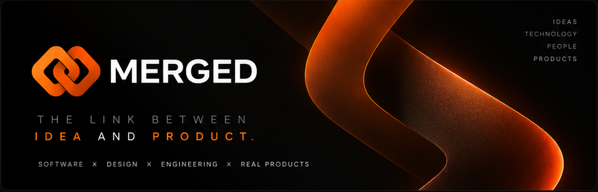
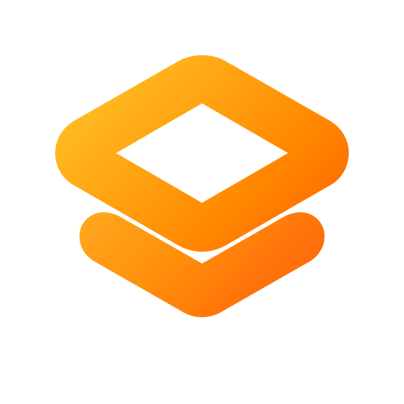
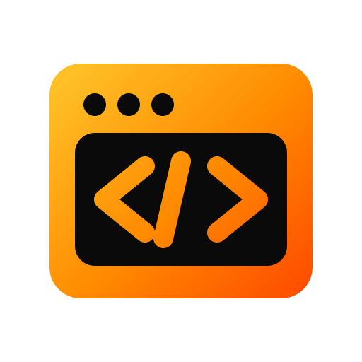
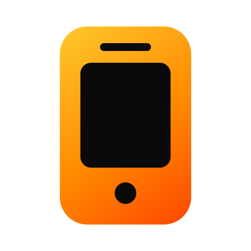
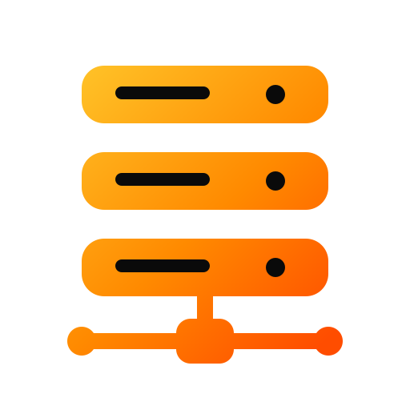
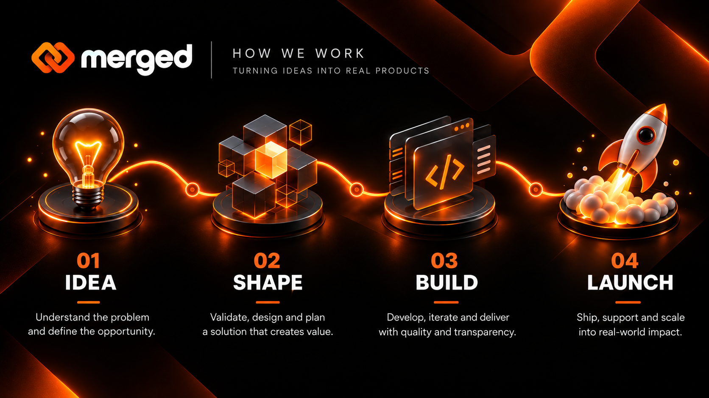
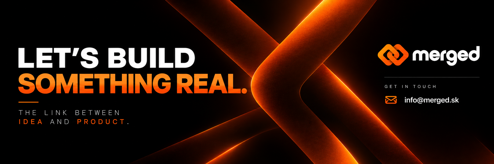

  

 

# **SOFTWARE & PRODUCT DEVELOPMENT STUDIO**

We turn ideas into polished digital products through **product thinking, sharp design and modern engineering**.

 

 

## **ABOUT MERGED**

> **From the first idea to a production-ready digital product.**

**MERGED** is a software and product development studio focused on turning ideas into real, thoughtfully built digital products.

We bring **product thinking, design and engineering** into one process — from defining the right problem to designing, building and delivering the final solution.

 

<table>
<tr>

<td width="25%" valign="top">

### 01 — PRODUCT

**Build the right thing.**

Clear scope, meaningful features and decisions driven by the actual problem — not unnecessary complexity.

</td>

<td width="25%" valign="top">

### 02 — DESIGN

**Make it feel intentional.**

Clean interfaces, strong hierarchy and consistent visual systems built around usability.

</td>

<td width="25%" valign="top">

### 03 — ENGINEERING

**Build it properly.**

Maintainable code, sensible architecture and reliable foundations designed to evolve with the product.

</td>

<td width="25%" valign="top">

### 04 — DELIVERY

**Turn it into reality.**

From the first concept to production without losing the original product vision along the way.

</td>

</tr>
</table>

 

**We don't build features for the sake of shipping features.**  
We build products that solve the right problem — and are designed to last.

## **WHAT WE BUILD**

<table>
<tr>
<td width="25%" valign="top">

### **PRODUCT DEVELOPMENT**
From early concept and validation to a complete digital product.

</td>
<td width="25%" valign="top">

### **WEB APPLICATIONS**
Fast, modern and carefully designed websites and web products.

</td>
<td width="25%" valign="top">

### **MOBILE DEVELOPMENT**
Cross-platform applications built around usability and maintainable architecture.

</td>
<td width="25%" valign="top">

### **ENGINEERING & INFRA**
Backend systems, APIs, integrations, databases, CI/CD and infrastructure.

</td>
</tr>
</table>

## **HOW WE WORK**

  

 

**IDEA → SHAPE → BUILD → LAUNCH**

Understand the problem. Define the right solution. Build it properly. Ship something real.

 

## **TECHNOLOGY**

### **WEB FIRST**

  

### **MOBILE · BACKEND · DATA · INFRA**

 

> We choose technology based on the product and its constraints — not because a framework is currently fashionable.

## **OUR PRINCIPLES**

<table>
<tr>
<td width="50%" valign="top">

### 🟠 **PRODUCT OVER FEATURES**
We care about whether something should exist, how it should work and what value it creates — not only whether it can be coded.

</td>
<td width="50%" valign="top">

### 🔗 **DESIGN + ENGINEERING**
Visual quality, usability and technical decisions should support each other from day one.

</td>
</tr>
<tr>
<td width="50%" valign="top">

### ⚡ **KEEP IT INTENTIONAL**
Less noise. Clearer decisions. Strong hierarchy. Clean execution.

</td>
<td width="50%" valign="top">

### 🚀 **BUILD FOR REALITY**
Maintainable software, sensible architecture and products ready for real users.

</td>
</tr>
</table>

## **SELECTED WORK**

 

Public case studies and selected repositories will be added here as MERGED grows.

<!--
### PROJECT NAME
A short, concrete sentence explaining what the product does and what MERGED delivered.

`TypeScript` `React` `Tailwind CSS` `Docker`

[**VIEW PROJECT →**](https://github.com/YOUR_ORG/YOUR_REPO)
-->

## **BUILD WITH US**

Have an idea, product or technical problem worth solving?

We bring together **product thinking, design and engineering** and turn it into something usable, maintainable and ready to ship.

**GET IN TOUCH:** [info@merged.sk](mailto:info@merged.sk)

 

  

